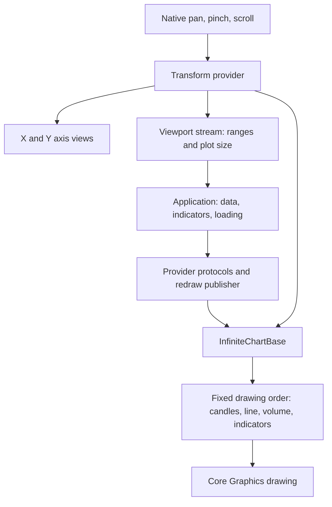

# Architecture and stock-app readiness

The original assessment on 2026-09-20 examined `main` at `42dcb0e` and the combined
rendering audit at `fedf666`. Updated on 2026-09-22, this document describes the
remaining stack based on `main` at `460d335`: provider rendering (#15), plot
composition (#16), axes (#17), and this documentation (#18). The coordinate,
lifecycle, provider-default (#12–14), and viewport ownership (#19) changes are merged.
Proposed APIs below remain unimplemented.
See the [PR review order](RenderingAudit.md#review-order) for the responsibility split.

## Verdict

The rendering foundation is appropriate for a native macOS stock app. Its small
public API still lacks independent, composable drawing modules. The audit improves
correctness; follow it with shared geometry and injectable drawing layers.

## What exists



- [InfiniteChartBase](../Sources/InfiniteChart/InfiniteChartBase.swift) owns layout,
  subscriptions, renderer selection, and drawing order. One provider's protocol
  conformances enable built-ins. The audit enables the previously disabled line renderer.
- [Provider protocols](../Sources/InfiniteChart/DataProvider/ChartDataProvider.swift)
  separate supplied data from drawing. Fetching, storage, aggregation, indicator
  calculation, exchange calendars, and trading remain application responsibilities.
- [Transformers](../Sources/InfiniteChart/Utilities/Transformer/Transformer.swift)
  convert between data coordinates and plot points. The audit uses
  `CGAffineTransform` with a cached inverse; this is coordinate math, not a layer animation.
- [AffineTransformerProvider](../Sources/InfiniteChart/Utilities/Transformer/AffineTransformerProvider.swift)
  owns the current transform and derives its viewport from that state and the plot
  dimensions. Private current-value storage commits updates before notifying
  subscribers, keeping synchronous coordinate and viewport reads consistent.
  Candidate geometry is validated before changing provider state.
- [ChartViewport](../Sources/InfiniteChart/ChartViewport.swift) reports visible X/Y
  ranges and plot size. [ChartPlatformView](../Sources/InfiniteChart/Platform/ChartPlatformView.swift)
  bridges AppKit/UIKit; macOS uses a flipped view with a top-left origin.
- [ChartBaseView](../Sources/InfiniteChart/Components/ChartBaseView.swift) handles
  plot gestures. Its gesture protocol needs only the transform provider and allowed
  axes; the unused publisher and associated-type requirements have been removed.
  Axis views restrict their gestures to the corresponding dimension.

These boundaries keep application services outside the library. The main remaining
coupling is that the host knows every renderer and constructs all of them from one
provider. Combining built-in provider protocols is useful convenience composition,
but it cannot supply an independently implemented renderer or its own data source.

## What blocks arbitrary drawing

1. **No public drawing hook.** Built-in renderers and the live transformer are
   internal. `InfiniteChartBase` is public rather than open, so consumers cannot
   subclass it outside the module either ([Swift access rules](https://github.com/swiftlang/swift-evolution/blob/main/proposals/0117-non-public-subclassable-by-default.md)). Opening it for subclassing alone would
   still leave consumers coupled to host internals.
2. **No shared public geometry object.** Viewport ranges allow applications to
   reconstruct today's linear mapping, but that duplicates library behavior and
   does not provide an explicit plot rectangle, pane identity, or conversion contract.
3. **No layer refresh contract.** Native invalidation already exists: macOS
   `needsDisplay = true`, or iOS `setNeedsDisplay()`. A layer API should document
   content refresh through these methods or an optional cross-platform wrapper.
4. **No public interaction arbitration.** There is no annotation hit-testing or
   pointer-event contract to decide whether a drag moves a drawing or pans the chart.
5. **Volume is an overlay, not an independent pane.** In
   [the host's draw method](../Sources/InfiniteChart/InfiniteChartBase.swift), the
   price transform spans the entire plot; `mainChartRect` only positions volume.
   [VolumeRender](../Sources/InfiniteChart/Renders/VolumeRender.swift) scales bars to
   the visible maximum in the bottom third. There is no separate volume Y scale,
   axis, or publicly addressable pane. An RSI panel needs those concepts.

Native `addSubview` or sibling overlays are possible today; applications must
reconstruct geometry and manage their overlay layout and interaction themselves.

The viewport stream is also a public `CurrentValueSubject`: consumers can send
values or complete it. A future read-only current-value wrapper should preserve
snapshot reads and subscriptions while keeping writes private.

## Smallest coherent extension — proposal only

Illustrative API shape, not an available or implemented API:

```swift
@MainActor
public protocol ChartLayer {
    /// Draws this layer's content using the context's immutable plot geometry.
    func draw(in context: ChartRenderContext)
}

// Immutable geometry snapshot for one plot/pane:
// ChartGeometry: viewport, plotRectInView,
//   plotPoint(forData:), dataPoint(forPlot:),
//   viewPoint(forPlot:), plotPoint(forView:)
// ChartRenderContext: CGContext + ChartGeometry

// Keep the provider initializer; add ordered layers + initial viewport configuration.
let chart = InfiniteChartBase(layers: [sessionBand, candles, orderLine, tradeMarkers])
chart.needsDisplay = true // macOS content refresh; iOS uses setNeedsDisplay().
```

A drawing layer here is a module, not a requirement to use `CALayer`. Each layer
owns its supplied data and styling. The host supplies one consistent
geometry snapshot for a draw, isolates graphics state per layer, and clips plot
layers to the plot. Array order defines drawing order. Native controls and axis
badges can use the same geometry in a separate view overlay. Do not expose the
mutable transformer provider just to make conversion possible. Public converters
should not promise that `CGAffineTransform` represents every scale: logarithmic
prices and compressed trading sessions require additional mapping. The app/provider
chooses timestamp or bar-index X units; the affine backend maps its linear units.

Use precise coordinate names:

| Space | Meaning | Example |
| --- | --- | --- |
| Data | Provider-defined X units and the selected Y scale | Timestamp/bar index and price |
| Plot | Points from the plot's top-left corner, excluding axes | Fixed-size marker or hit-test tolerance |
| View | Points in the chart view, including plot placement and axis margins | Native tooltip or price badge |

AppKit's flipped chart view and UIKit use Y increasing downward; increasing data
price maps upward. Sizes and strokes use points, not backing-store pixels, even
though existing transformer methods say `pixel`. Convert external pointer locations
into chart-view coordinates before applying the geometry conversion, using
[AppKit view conversion](https://developer.apple.com/documentation/appkit/nsview/1483406-convertpoint) when crossing view boundaries. Pan, zoom,
and resize must refresh geometry and redraw; content-only invalidation must not
invent a viewport change. Keep drawing, layer mutation, and native view updates on
the main actor.

## What stock annotations need

| Drawing | Anchor and composition |
| --- | --- |
| Order line | Convert a data price to Y; span plot width. Place a badge in view space beside the plot. |
| Trade marker | Convert a data `(x, price)` anchor; draw a fixed-size glyph in plot points. |
| Session/price band | Convert data X or Y limits; use plot bounds for the other dimension. Draw behind candles. |
| Cursor/crosshair | Convert pointer view → plot → data; optionally snap using app data, then draw foreground lines. |
| Editable trendline | Store endpoints in data units; hit-test in plot points so the tolerance stays usable at every zoom. |

The library owns coordinate conversion, rendering order, clipping, and optional
interaction mechanics. The application owns annotation records, selection,
snapping policy, editing state, menus, and order submission. An optional hit-test
contract can return an application-owned identifier; gesture arbitration should
let an accepted annotation drag consume the gesture before chart panning begins.
Passive drawing layers should not be required to implement interaction methods.

## Follow-up PRs after the correctness split

1. Public immutable geometry and explicit coordinate conversion, preserving the current viewport contract.
2. Ordered injectable layers, isolated drawing state, and independent invalidation; adapt built-ins to the same seam.
3. Pointer events, optional hit testing, and configurable gesture arbitration.
4. Real pane layout with shared X navigation, independent Y scales/axes, and explicit pane targeting.
5. Read-only current-value viewport API with a compatibility migration; styling can evolve separately.

Validate the extension through an ordinary `import InfiniteChart` consumer that
supplies its own order-line and trade-marker layers. Verify anchors after pan,
zoom, and resize, fixed-point glyph sizes, content-only redraw, clipping, and
pointer round trips. `@testable import` tests alone cannot prove the public API is
usable. Rendering many samples and indicators also needs representative app
profiling; the affine conversion microbenchmark is not a frame-time guarantee.
